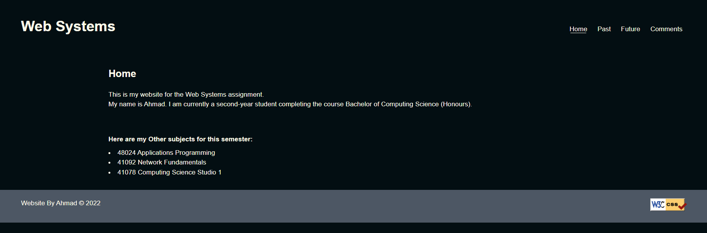
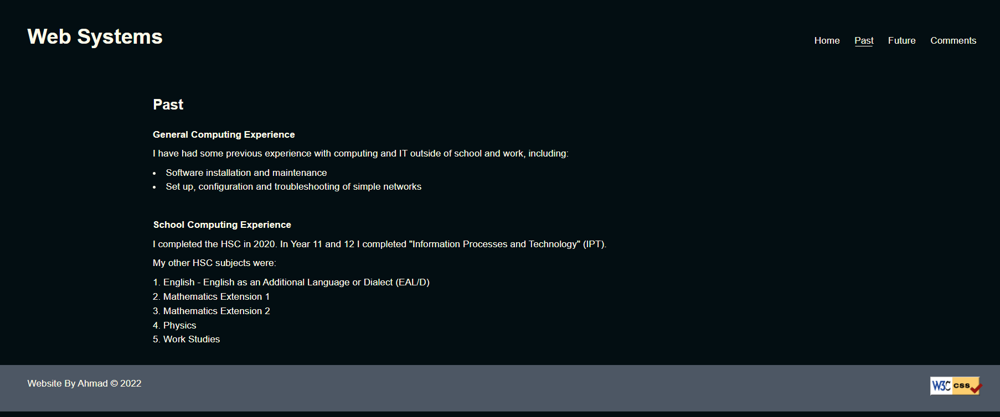
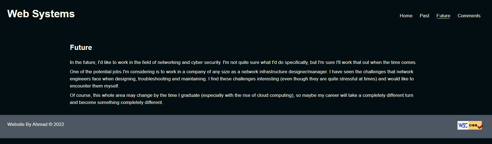
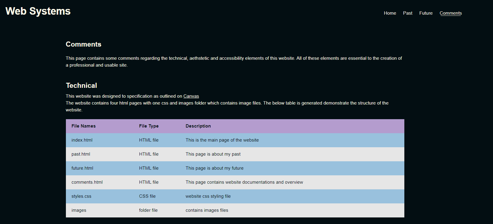
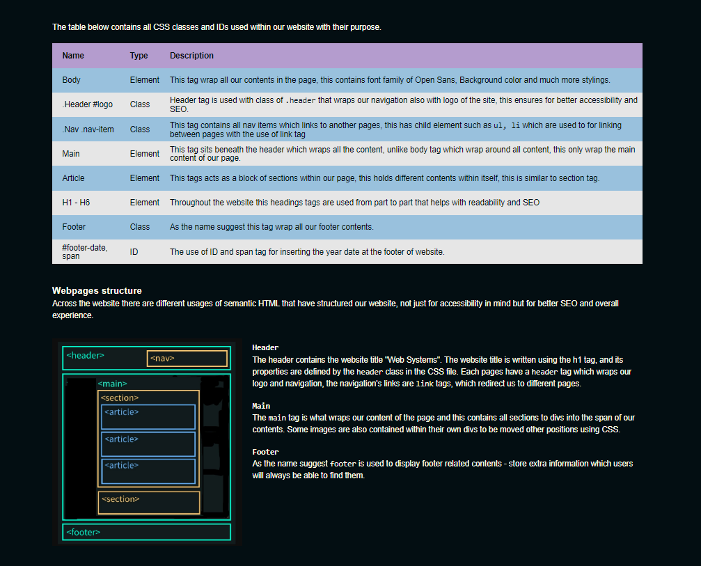
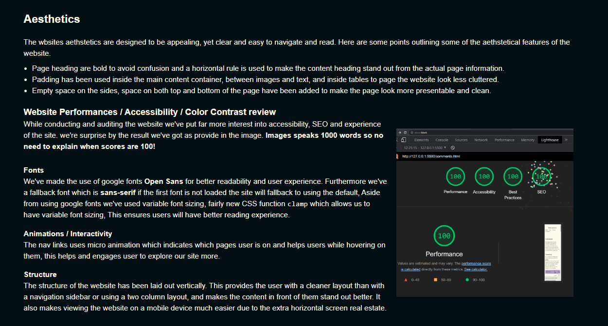
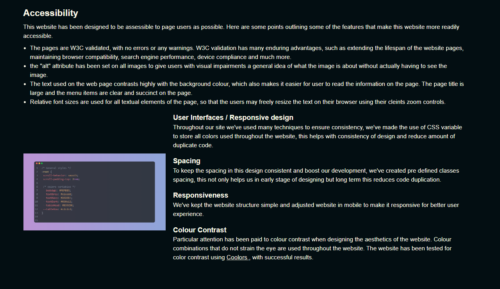

# static_website_html_css

This website was built based on the specification below. This project evaluates two key abilities: building a live, functional website and showcasing some fundamental HTML/CSS abilities.

## Specification

You will create a webpage about yourself that must adhere to the requirements below. The real information you provide about yourself is not what's relevant here and is not evaluated. It will still be subject to plagiarism detection and must, of course, be your own unique work and not plagiarized. There are no strict minimum or maximum word or content constraints, so you are free to delve deeper into the topics that interest you. Your HTML/CSS and website design skills will be tested by this challenge.
Your website will have 4 pages and 1 CSS file.
Any other files, such as photos (jpg, png, etc.), should be in the websystems directory. To keep things organized, they might also be in subdirectories, like websystems/images.
Your website needs to function without Javascript and even with CSS turned off.

## Home page

## Past page

## Future page

## Comment page

